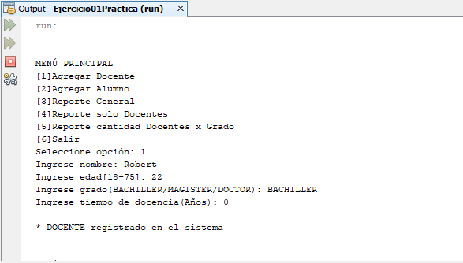

# Sistema colegio herencia
Sistema sobre un colegio con herencia simple de una en docentes o alumnos, donde se puede registrar un docente, registrar un alumno, listar las personas registradas, listar los docentes registrados y mostrar la cantidad de docentes registrados por grado de educación, **29/11/19**.

<strong>Imagen:</strong> Menú principal - Agregar docente.

